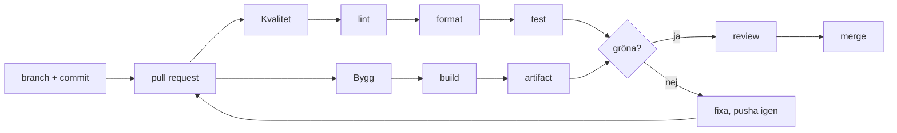

```mermaid
flowchart LR
  B[branch + commit] --> PR[pull request]

  PR --> Q[Kvalitet]
  Q --> L[lint]
  L --> FM[format]
  FM --> T[test]

  PR --> BU[Bygg]
  BU --> BI[build]
  BI --> AR[artifact]

  T --> S{gröna?}
  AR --> S

  S -->|ja| RV[review] 
  RV --> M[merge]
  S -->|nej| FX[fixa, pusha igen]
  FX --> PR
```

| Steg | Tid |
|---|---:|
| `npm ci` i Kvalitet | 3 s |
| `lint` | 1 s |
| `format:check` | 0 s |
| `test` | 2 s |
| `npm ci` i Bygg | 4 s |
| `build` | 1 s |
| Hela körningen | 12 s |
